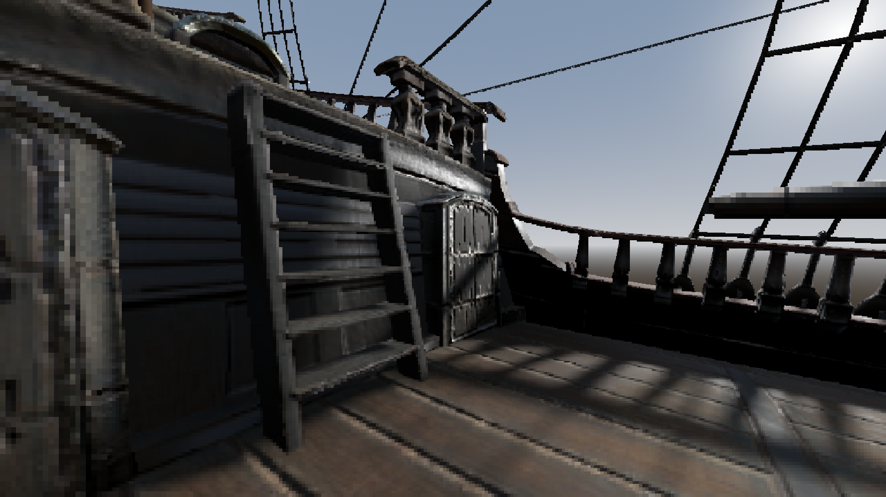

# Depth Pixelator

Depth Pixelator is a proof-of-concept addon for Godot 4.4+ which adds a compositor effect that can progressively pixelate the screen based on scene depth. For example, big pixels on close geometry and small pixels on far geometry.

## What makes this different?

This can either act as a pixel style depth-of-field, or a pseudo-view space pixelation post process. The core of this effect is that it creates multiple "downsample layer" buffers which represent different slices of scene depths, and populates them with only the pixels that fall in that range. This means that no colors from the foreground bleed into what should be the background and vice-versa. The effect then composites the final image by sampling all buffers, resulting in large, chunky pixels, which extend beyond the silhouette of the geometry that first made its way into the downsample layer.

## Customizable options

- Downsample layer count
  - How many buffers the scene should be sliced into
- Progressive resolution scale per layer
  - How much smaller each layer's resolution should be compared to the previous
- Curve of depth slice distribution
  - The exponent which controls how bunched up the layers are throughout the near-far range
- Layer blend amount
  - Adds a smooth fade at the edge of each layer's depth cutoffs
- Near distance
  - The distance at which the highest resolution buffer should be used
- Far distance
  - The distance at which the lowest resolution buffer should be used
- Sample all layers
  - On by default. When disabled, this removes the chunky effect, and makes this appear like a more naïve depth pixelation implementation
- Minimum downsample layers
  - Remaps what the lowest layer to sample from is. Can be turned up to achieve more intense base pixelation
- Downsample method
  - How the effect chooses what color to display
    - Average: Mean average of all valid pixels
    - Brightest: The valid pixel with the highest luminance color is selected
    - Darkest: The valid pixel with the lowest luminance color is selected
    - Pixel: The bottom-rightmost valid pixel is selected
    - Closest Depth Pixel: The pixel with the nearest depth value is selected

## A note on production-readiness

This is not particularly optimized and was more of a fun experiment. It's certainly usable depending on how you configure it, but VRAM usage may be higher than necessary and the shader does not use any code generation to prune unused uniforms. Keep an eye on the GPU frametime of "Process Post Sky Compositor Effects" in the visual profiler when messing with settings, some scenarios such as downsampling into too small of a buffer may be unexpectedly heavy.

## Credits

Made by [fragskye](https://bsky.app/profile/fragskye.bsky.social)

Demo model: [Dutch Ship Large 01](https://polyhaven.com/a/dutch_ship_large_01) (CC0) by [James Ray Cock](https://www.artstation.com/jamesray), [Nicolò Zubbini](https://www.artstation.com/nizu), and [Rico Cilliers](https://www.artstation.com/rico_b3d)

[MIT License](LICENSE)
